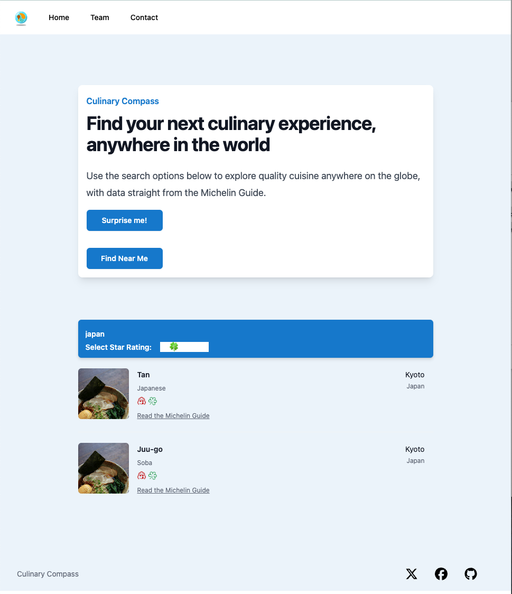
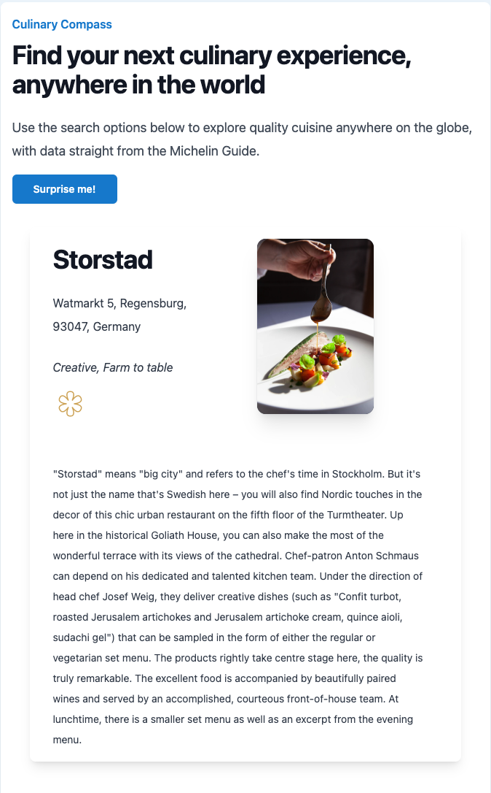
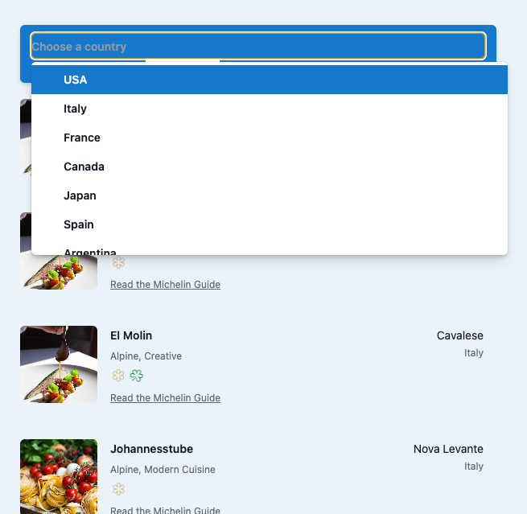
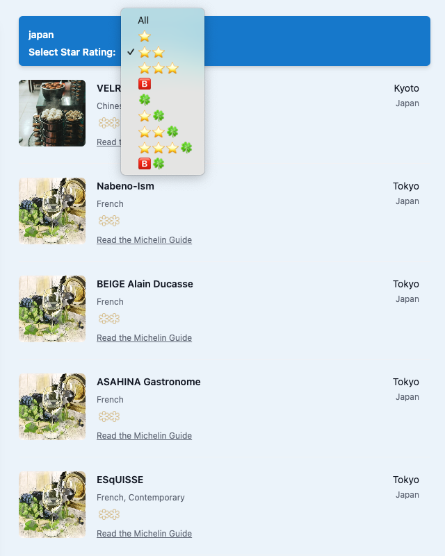
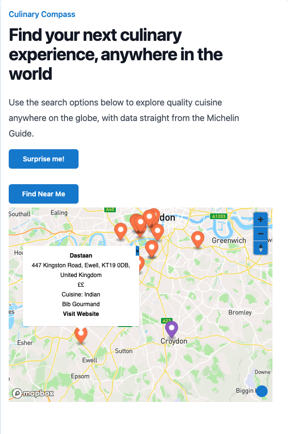
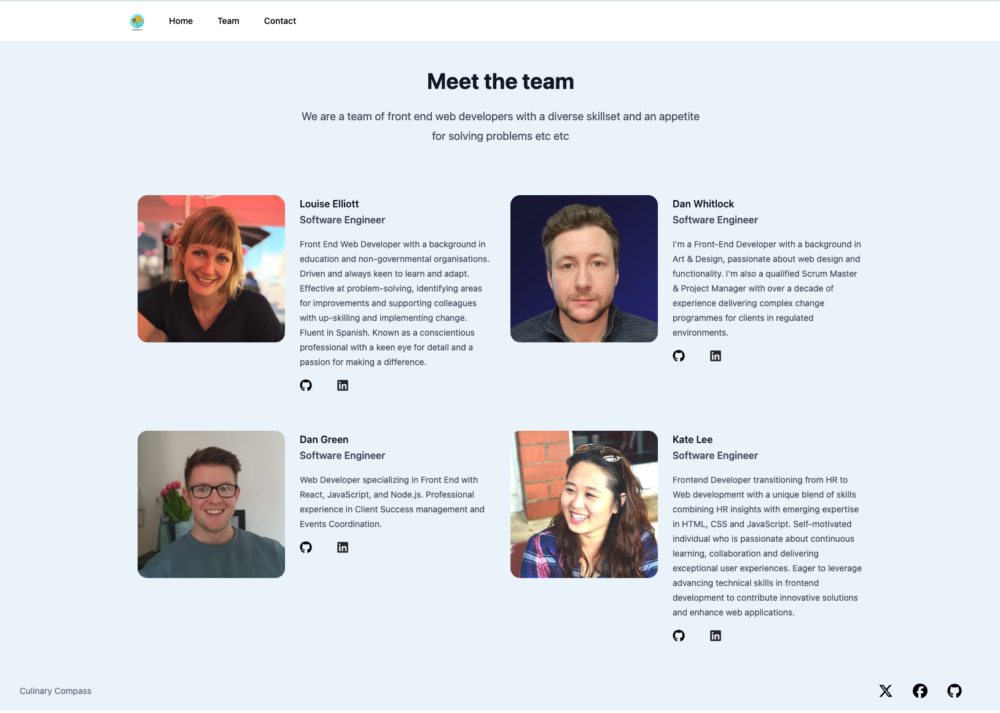
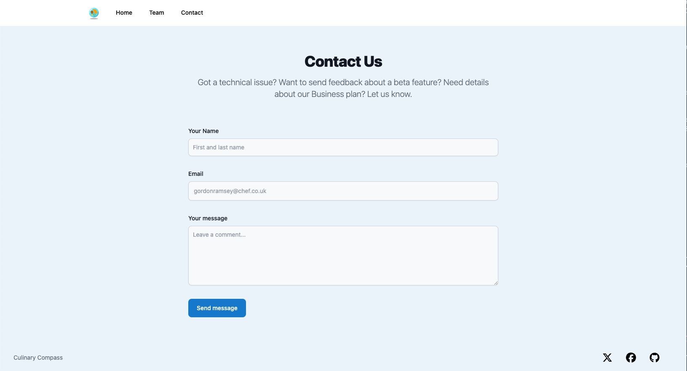

# Culinary Compass

## Description

- You know that feeling, when you want to go out to eat somewhere different, somewhere special, but you can’t decide where?! With so much information these days, it can be hard to make a simple choice, so we end up going back to the same restaurants over and over again.

- Culinary Compass allows you to search Michelin restaurants, filtering either by those nearby or in a certain country, by how many Michelin stars they have, and even gives you the chance to be told where to go for when you are feeling spontaneous!

 

## License

 
## Contents

- [Description](#description)
- [License](#license)
- [Installation](#installation)
- [Usage](#usage)
- [Contributions](#contributions)
- [Tests](#tests)
- [Questions](#questions)

 

## Installation

- To install dependencies run command

  > npm i

- To access the map functionality in the application
  > You must get your own API Key from
  > https://www.mapbox.com
  >
  > - Make a .env file, and name the environment variable VITE_MAPBOX

 

## Usage

- **_Culinary Compass_** welcomes you with a greeting and an explanation of how to use it.
- You are then straight onto the home page, where you can see all 7,000 Michelin restaurants or a smaller selection.

  - If you want somewhere nearby, you can search restaurants near you and see the results pinned on a map along with your own pinned location.
  - If you are going on holiday or a business trip, you can filter the results by country and by stars, then click on any restaurants of interest to be taken straight to the corresponding Michelin page.
  - If you are stuck for inspiration, you can click on random!
    The app also features a ‘Meet the team’ page and a Contact page for any potential employers who like what they see.

Code is written so that when the user selects different navbar tabs, corresponding information is displayed such as Home, Team and Contact that takes user to relevant pages.

 

## Contributions

- Louise Elliot : Country search functionalit & Meet the team page

- Dan Green : Random search functionality & Contact page
- Dan Whitlock : Michelin data, responsiveness of page & styling of whole application
- Kate Lee : Location search functionality & MapBox API

Pull requests are welcome. For major changes, please open an issues first to discuss what you would like to change.

 

## Tests

- To run tests, run command
  > npm test

 

## Questions

- If you have any questions about the repo, open an issue or contact the team via Linkedin provided in the Team page. You can also find more of our work on our GitHub.

 

# The final deployed application should look like this

- Homepage
   
  
   
   
- Random generator
   
  
   
   
- Country Search
   
  
   
   
- Michelin star filter
   
  
   
   
- Find Near Me results
   
  
   
   
- Team Page
   
  
   
   
- Contact Page
   
  
